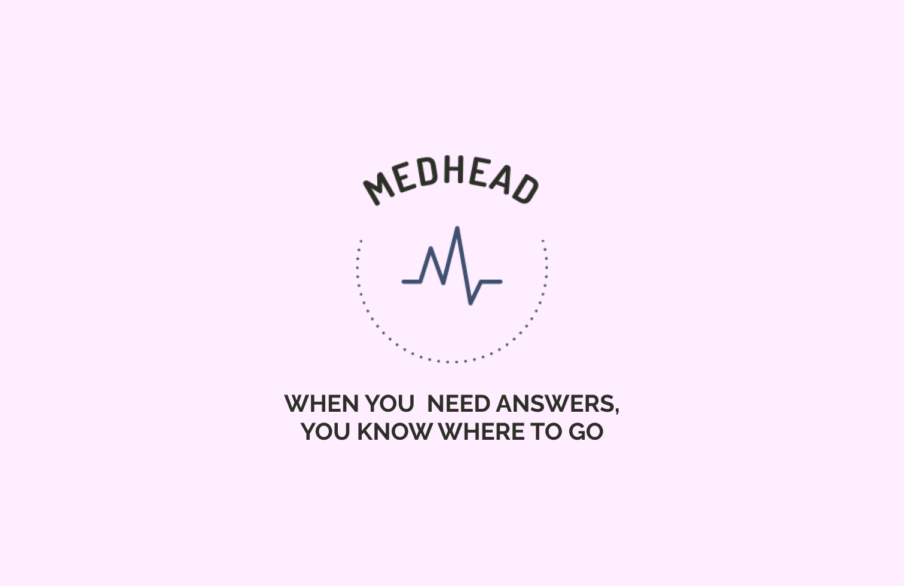
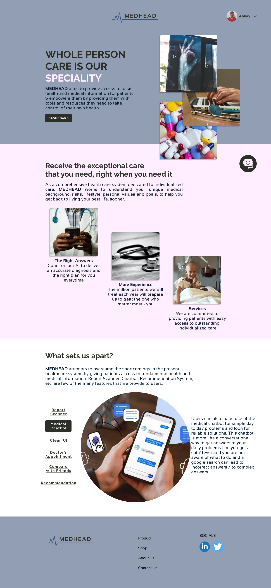
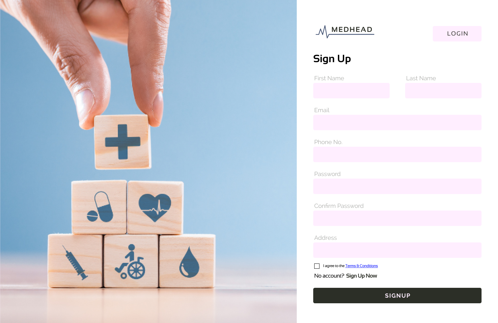
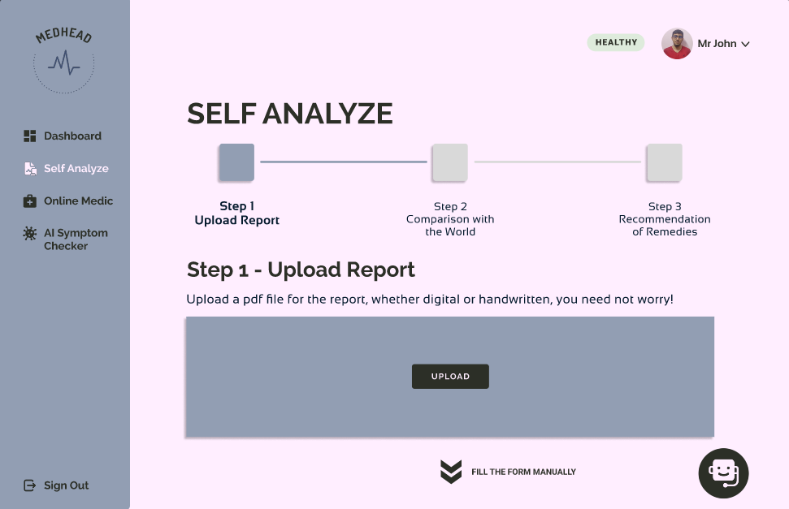
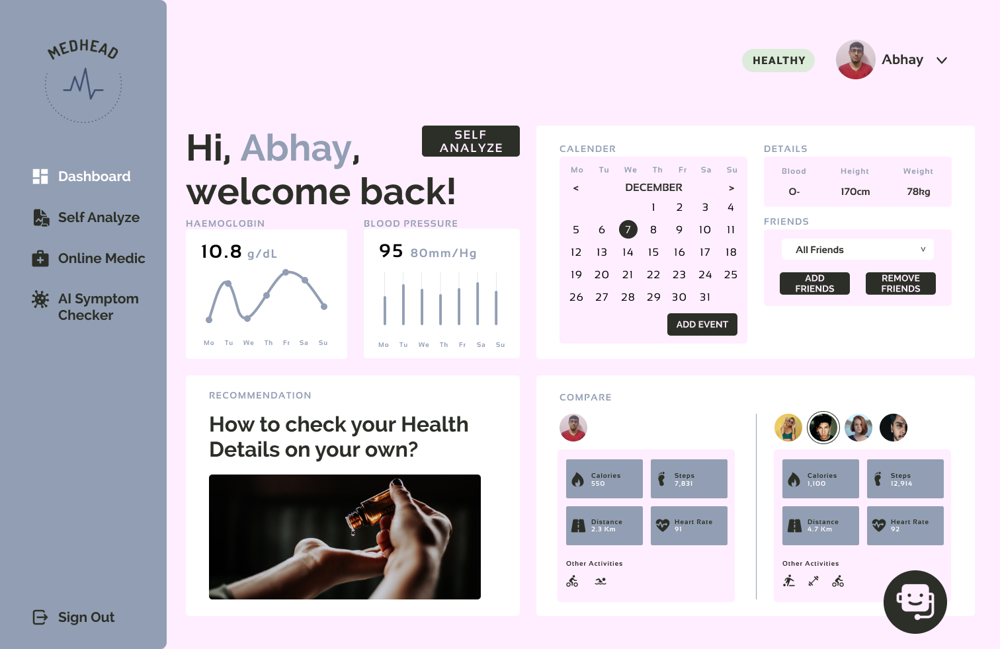
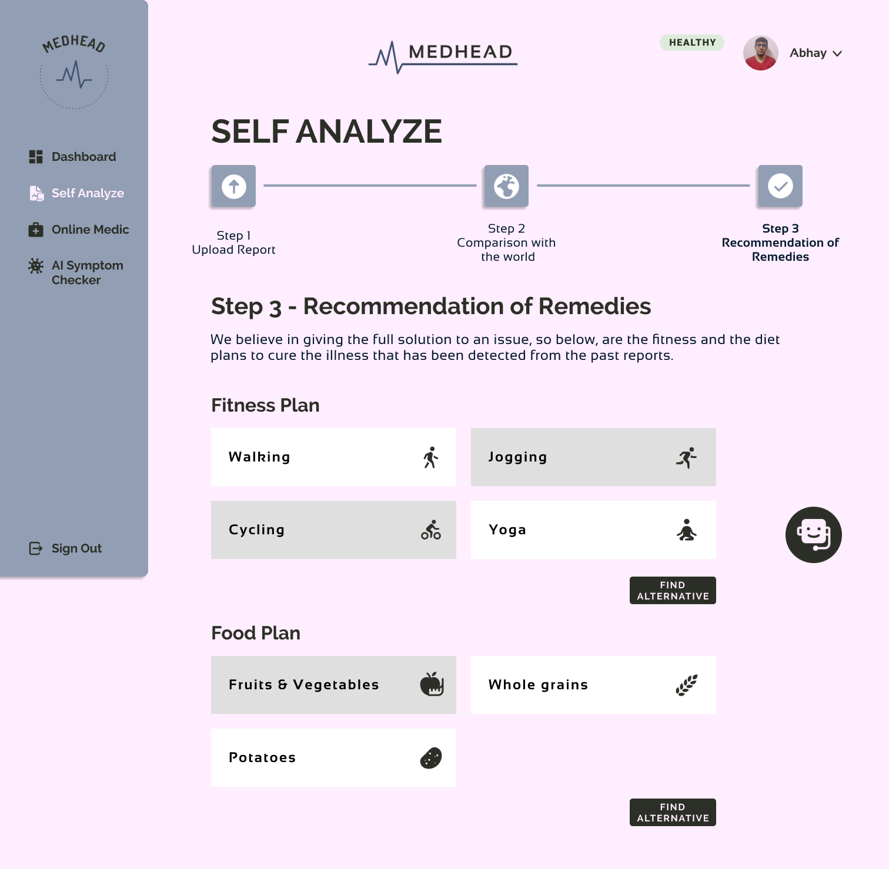
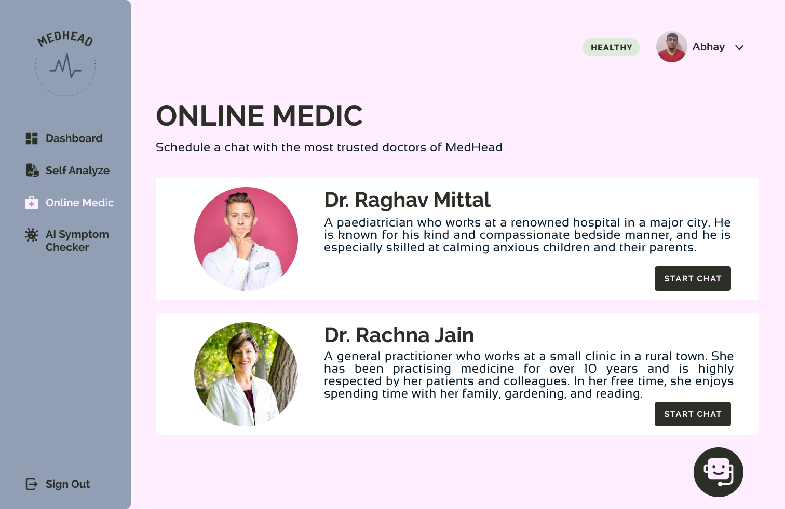

# MEDHEAD - ZS Prize Hackathon Submission

This repository contains the code for **MEDHEAD** a product that aims to address the inadequacies in the current healthcare system by providing access to basic health and medical information for patients.

## Table of Contents

- [Problem Statement](#problem-statement)
- [Background](#background)
- [Our Approach](#our-approach)
- [Features and Interface](#features-and-interface)
  - [Clean UI](#clean-ui)
  - [Report Scanner](#report-scanner)
  - [Medical Chatbot](#medical-chatbot)
  - [Comparison with Friends](#comparison-with-friends)
  - [Recommendations Module](#recommendations-module)
  - [Online Medic](#online-medic)
- [Flow Diagram](#flow-diagram)
- [Submissions](#submissions)
- [Authors](#authors)

## Problem Statement

Address inadequacies in the system by pushing awareness and giving patients access to basic health and medical information.

## Background

India has a chronic disease burden or non-communicable diseases burden of almost 20% of its population, where nearly 200 million people have some chronic disease. Of that, just diabetes and hypertension afflict some 100 million people, and that patient population is growing by 13% a year. To make matters worse, the rate of patient adherence to prescribed treatments is abysmally low.

## Our Approach
* Currently there is dysfunction in healthcare, the cost of medicines outweigh the outcomes of the patients.
* MEDHEAD aims to address the inadequacies in the current healthcare system by providing access to basic health and medical information for patients.

## Features and Interface
* Clean UI
* Report Scanner
* Medical Chatbot
* Comparison with Friends
* Recommendations Module
* Doctor Appointment

### Clean UI
* We have a clean and simple user interface which anyone can use regardless of their age. Users can login using any account they feel comfortable with such as google account or create a new account using their email id.

> Landing Page

> Login Page

### Report Scanner
* We have also built an automated report scanner using OCR which will remove the need for people to manually enter their records and results.
* Just a simple upload will retrieve all their details.
* This will be very convenient for the user and if something is not captured by the OCR then they can modify accordingly using manual input too.

> Self Analyze Page

### Medical Chatbot
* Users can also make use of the AI powered medical chatbot for simple day to day problems and look for reliable solutions.
* This chatbot is more like a conversational way to get answers to your daily problems like you got a cut / fever and you are not aware of what to do and a google search can lead to incorrect answers / to complex answers.
* This will give you the point and accurate answers.

> Medical Bhatbot Page

### Comparison with Friends
* We have also added a new functionality of comparing your results with your close ones which will lead to a healthy competition and cause people to exercise more and go out to gym, it will work like a motivation factor.

> Dashboard Page - View your past reports and compare with friends

### Recommendations Module
* The main work of this module is to analyse the user details for this reports and suggest based on it the proper diet and exercise needed to maintain a good health.

> Recommendation Page

### Online Medic
* We have also added a section called as Online Medic in the end where incase of a problem which needs a doctor's suggestion then the user can book an appointment straight from the app itself.

> Online Medic Page

## Flow Diagram

## Submissions
* ### Presentation Link: [Link](https://www.canva.com/design/DAFVSXew4YQ/0u63ZmSRuJcKQij5mTh9Vg/view?utm_content=DAFVSXew4YQ&utm_campaign=designshare&utm_medium=link2&utm_source=sharebutton#1)
* ### Demonstration Video Link: [Link](https://www.youtube.com/watch?v=rbJihmgOWeU&ab_channel=AbhayArora)
* ### Figma Prototype Link: [Link](https://www.figma.com/file/zRIvgByb1na7Xxis3kZU8Z)

## Authors

#### Neeraj J Manurkar
* [GitHub](https://github.com/Neerajjr11)
* [LinkedIn](https://www.linkedin.com/in/neeraj-j-manurkar-64372b212/)

#### Abhay Arora
* [GitHub](https://github.com/SPAbhay)
* [LinkedIn](https://www.linkedin.com/in/abhayarora27)

#### [Delano Lourenco](https://delanolourenco.xyz)
* [GitHub](https://github.com/3ddelano)
* [LinkedIn](https://www.linkedin.com/in/delano-lourenco-a9022a190)

#### Kevin Gandhi
* [GitHub](https://github.com/KevinGandhi9898)
* [LinkedIn](https://www.linkedin.com/in/kevin-gandhi-7a26b61b8/)

#### Nihal Srivastava
* [GitHub](https://github.com/Nihal-Srivastava05)
* [LinkedIn](https://www.linkedin.com/in/nihal-srivastava-7708a71b7)
